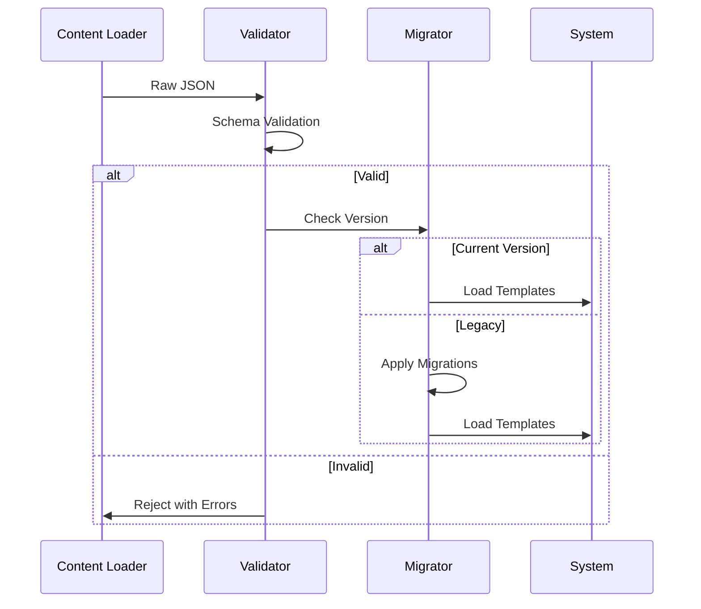

# Template Event System Architecture

## Core Type Definitions ([`src/types.ts`](src/types.ts:1))
```typescript
// Content Metadata and Versioning
interface ContentMeta {
  version: string;
  author?: string;
  aiGenerated?: boolean;
  tags: string[];
  createdAt: Date;
  lastModified: Date;
}

// Conditional Logic Types
type NumericRange = [min: number, max: number];
type StatCondition = {
  [K in keyof Character]?: NumericRange | number;
} & { 
  traits?: string[];
  requiredEvents?: string[];
  blockedEvents?: string[];
};

// Consequence System
interface Consequence {
  effects: Array<{
    stat: keyof Character;
    operation: 'add' | 'multiply' | 'set';
    value: number;
    duration?: number; // For temporary effects
  }>;
  followUpEvents?: string[];
  newTraits?: string[];
  removeTraits?: string[];
}

// Event Template Structure
interface EventTemplate {
  id: string;
  description: string;
  conditions: {
    character: StatCondition;
    minAge?: number;
    maxAge?: number;
    probabilityWeight?: number;
  };
  choices: Array<{
    text: string;
    consequences: Consequence[];
    weight?: number;
    aiCondition?: string; // Natural language condition for LLM
  }>;
  meta: ContentMeta;
}
```

## JSON Schema Validation (`events.json`)
```json
{
  "$schema": "http://json-schema.org/draft-07/schema#",
  "definitions": {
    "numericCondition": {
      "oneOf": [
        { "type": "number" },
        { 
          "type": "array",
          "items": { "type": "number" },
          "minItems": 2,
          "maxItems": 2
        }
      ]
    },
    "consequence": {
      "type": "object",
      "properties": {
        "effects": {
          "type": "array",
          "items": {
            "type": "object",
            "properties": {
              "stat": { "enum": ["health", "wealth", "intelligence", "morality"] },
              "operation": { "enum": ["add", "multiply", "set"] },
              "value": { "type": "number" },
              "duration": { "type": "number", "minimum": 0 }
            },
            "required": ["stat", "operation", "value"]
          }
        }
      },
      "required": ["effects"]
    }
  }
}
```

## Validation Workflow


## Version Control Strategy
1. Semantic versioning (major.minor.patch)
2. Content manifest with SHA-256 hashes
3. Migration path definitions:
```typescript
type Migration = {
  fromVersion: string;
  toVersion: string;
  migrate: (template: any) => any;
};

const migrations: Migration[] = [
  {
    fromVersion: "1.0.0",
    toVersion: "1.1.0",
    migrate: (template) => ({
      ...template,
      meta: {
        ...template.meta,
        createdAt: new Date().toISOString()
      }
    })
  }
];
```

## Sample Event Template
```json
{
  "id": "event_teen_car_accident",
  "description": "A reckless driver swerves into your lane...",
  "conditions": {
    "character": {
      "health": [60, 100],
      "traits": ["reckless"],
      "requiredEvents": ["event_teen_got_license"]
    },
    "minAge": 16,
    "maxAge": 19,
    "probabilityWeight": 0.25
  },
  "choices": [
    {
      "text": "Swerve into the ditch",
      "consequences": [{
        "effects": [
          { "stat": "health", "operation": "add", "value": -30 },
          { "stat": "morality", "operation": "add", "value": 10 }
        ],
        "newTraits": ["cautious"]
      }]
    }
  ],
  "meta": {
    "version": "1.1.0",
    "tags": ["adolescence", "danger"],
    "aiGenerated": true,
    "createdAt": "2025-05-23T01:35:00Z"
  }
}