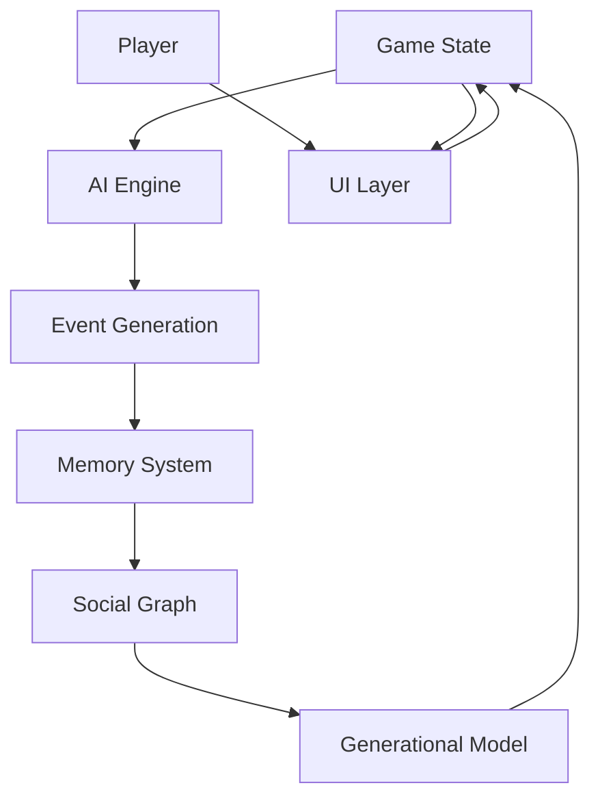

# Lifelike Phase 2 Development Plan

## Objectives
1. Implement AI-driven narrative generation
2. Enhance character memory systems
3. Add generational gameplay mechanics
4. Improve social simulation depth

## Key Features

### AI Narrative Engine
- Integrate OpenAI/DeepSeek API for dynamic event generation
- Create prompt templates for life events based on character context
- Implement caching system for generated content

### Memory System
- Expand character memory to track:
  - Significant life events
  - Relationship milestones
  - Personal achievements
- Implement memory decay/consolidation mechanics

### Generational Gameplay
- Add family tree system
- Implement inheritance of traits/stats
- Create legacy mechanics

### Social Simulation
- Add social network visualization
- Implement reputation system
- Add group dynamics (cliques, organizations)

## Technical Architecture

## Implementation Roadmap
1. Week 1-2: AI integration prototype
2. Week 3-4: Memory system implementation
3. Week 5: Social graph development
4. Week 6: Generational systems
5. Week 7: Integration testing
6. Week 8: Polish and optimization

## Success Metrics
- 50+ unique event templates
- NPC memory retention > 80% for key events
- Average 3+ generations played per session
- Social network depth > 5 connections