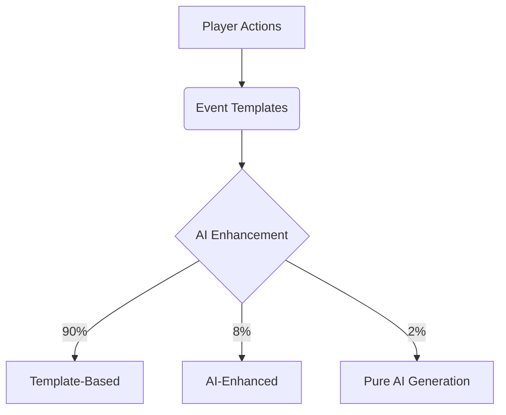
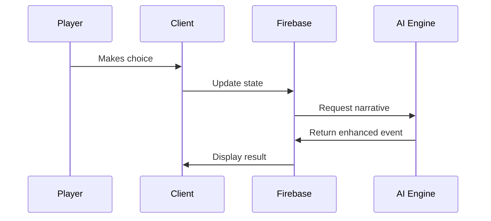

# Lifelike Project Plan

## Project Vision
Create an AI-driven life simulation game where:
- Every NPC has memory, personality, and personal journey
- Player choices create ripple effects across decades
- Emergent storytelling powered by generative AI
- Multi-generational gameplay with evolutionary traits

## Development Phases

### Phase 1: Foundation (Months 1-6)
**Objectives:**
- Establish core game loop
- Implement basic AI systems
- Create technical infrastructure
- Build minimum viable content pipeline

**Key Deliverables:**
1. Core Game Systems:
   - Character creation with stats/traits
   - Age progression system
   - Basic event/choice framework

2. Technical Infrastructure:
   - Firebase integration (Auth, Firestore)
   - React UI framework
   - Hybrid AI architecture

3. Content Pipeline:
   - 50+ template events
   - Basic career/education paths
   - Simple relationship mechanics

### Phase 2: AI Integration (Months 4-12)
**Objectives:**
- Implement narrative generation
- Develop decision impact system
- Create basic NPC behaviors

**Key Deliverables:**
1. AI Systems:
   - Narrative writer (GPT/DeepSeek integration)
   - Decision impact engine
   - Basic NPC personality system

2. Gameplay Systems:
   - Skill progression
   - Career advancement
   - Relationship depth

### Phase 3: NPC Memory (Months 10-18)
**Objectives:**
- Implement NPC memory system
- Develop goal-driven behaviors
- Create cascade effect mechanics

**Key Deliverables:**
1. Advanced AI:
   - NPC memory engine
   - Goal-oriented behavior system
   - Emotional state modeling

2. Gameplay Systems:
   - Long-term consequence tracking
   - Multi-generational traits
   - Dynamic social networks

### Phase 4: World Building (Months 16-24)
**Objectives:**
- Implement historical progression
- Develop location-based systems
- Create multiplayer foundation

**Key Deliverables:**
1. World Systems:
   - Era-specific content
   - Cultural/location differences
   - Global event system

2. Community Features:
   - Multiplayer integration
   - Modding tools
   - Shared story platform

## Technical Architecture

### AI Implementation Strategy

### Data Flow

## Team Structure

### Phase 1 Team (6 Members)
1. **Technical:**
   - 2x React/TypeScript Developers
   - 1 Firebase/Backend Engineer
   - 1 AI Specialist

2. **Creative:**
   - 1 Game Designer
   - 1 UX Designer

### Phase 2 Expansion (+3 Members)
- Additional AI Engineer
- Narrative Designer
- QA Engineer

## Key Metrics

### Development Milestones
| Milestone | Target Date | Success Criteria |
|-----------|------------|------------------|
| MVP Prototype | 2025-09-01 | Core game loop functional |
| Alpha | 2026-01-01 | Basic AI integration complete |
| Beta | 2026-07-01 | NPC memory system operational |
| Release | 2026-12-01 | Full feature set implemented |

### Performance Targets
- Mobile: <500MB RAM usage
- AI Response: <2s for 95% of requests
- Offline: Core gameplay functions without internet

## Risk Management

### Technical Risks
1. **AI Performance:**
   - Mitigation: Phased rollout, edge computing

2. **Data Synchronization:**
   - Mitigation: Optimistic UI updates, conflict resolution

3. **Content Scaling:**
   - Mitigation: Template-based approach with AI enhancement

## Next Steps
1. Assemble Phase 1 team
2. Establish development environment
3. Begin core systems implementation
4. Create content pipeline framework